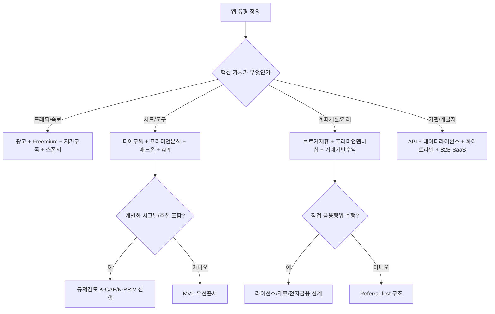
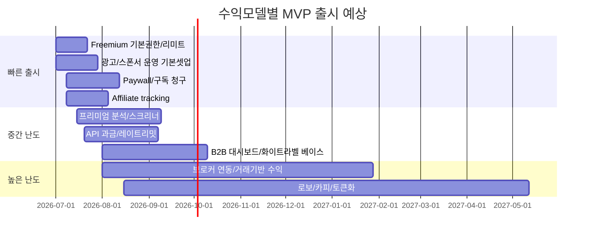

# 주식정보 웹앱과 모바일앱 수익화 모델 전수조사 보고서

## Executive summary

주식정보 앱의 수익화는 크게 **소비자 반복과금형**, **거래·브로커 연동형**, **데이터·인프라 B2B형**으로 나뉘며, 속도와 위험을 함께 고려하면 **초기에는 freemium+광고+저가 구독+브로커 제휴**, 중기에는 **프리미엄 분석·시그널·API 과금**, 장기에는 **브로커리지 연동·화이트라벨·B2B SaaS** 조합이 가장 현실적입니다. 반대로 **로보어드바이저, 소셜카피, 토큰화/크립토, 개별 종목 시그널의 개인화 추천**은 매출 상단은 크지만 한국의 자본시장 규제, 데이터 재배포 라이선스, 개인정보·자동화결정, 앱스토어 금융정책까지 동시에 맞물려 **출시 속도와 법무비용이 급격히 올라갑니다.**

공개 가격이 확인되는 글로벌 벤치마크만 놓고 보면, 저가 멤버십은 **월 $5~$12.95**, 일반적인 차팅·리서치 구독은 **월 $29.95~$59.95**, 액티브 트레이더용 고급 정보 서비스는 **월 $147~$197**, 리서치 번들은 **연 $199~$499**, 개발자용 API는 **월 $22~$229** 수준에서 많이 포지셔닝됩니다. 로보어드바이저는 **연 0%~0.25% AUM** 또는 **월 $5** 같은 구조가 확인됩니다. 2026-06-26 우리은행 달러 기준환율 1,539원을 적용하면, 대략 **월 7,700원~307,700원**, 연간 번들은 **약 30.6만~76.8만원** 범위입니다.

국내 출시 관점에서 가장 중요한 현실 제약은 세 가지입니다. 첫째, **개별 고객에게 종목·가격·시점을 1:1로 제시하는 서비스**는 유사투자자문업 또는 투자자문업 규제 리스크가 큽니다. 둘째, **KRX/KOSCOM 시세 재배포**는 단순 크롤링으로 대체할 수 없고 계약·라이선스·이용요금 체계를 따라야 합니다. 셋째, 앱 내 결제와 금융 기능은 **Apple의 금융앱 제출자 요건**, **Google Play 금융 기능 선언**, 한국의 **대체결제 제도**와 수수료 구조를 모두 함께 설계해야 합니다.

따라서 가장 추천되는 전략 조합은 다음과 같습니다. **뉴스형 앱**은 광고·스폰서십·저가 멤버십·제휴를, **차팅+시그널 앱**은 구독·프리미엄 분석·시그널·애드온·API를, **브로커 연동형 앱**은 프리미엄 멤버십·거래/자산기반 수익·현금/대차 스프레드·화이트라벨을 핵심으로 두는 것이 수익성 대비 실행성이 가장 좋습니다. TradingView, Robinhood, eToro, Alpaca, TipRanks, Twelve Data, FMP 같은 사례를 보면, 상위 사업자일수록 단일 모델이 아니라 **복수의 수익화 계층을 누적**하고 있습니다.

## 조사 범위와 가정

### 범위

본 보고서는 사용자가 요구한 범위에 맞춰 **subscription tiers, freemium, ads, affiliate/brokerage referrals, transaction fees, data licensing, API access, premium analytics, robo-advisory, signal services, social trading, white-labeling, in-app purchases, education/courses, events, sponsorships, marketplace, lead generation, pay-per-report, microtransactions, tokenization/crypto, B2B SaaS, consulting, hybrid bundles, others**를 모두 포함했습니다. 가격은 **공개된 공식 가격이 있는 경우만 공식가격**, 그렇지 않은 경우는 **모형가정** 또는 **검증필요**로 분리했습니다. 환산 기준은 **1 USD = 1,539 KRW**입니다.

### 미지정 사항과 본 보고서의 모델링 가정

사용자가 **목표 사용자 수, 국가 범위, 자체 증권 라이선스 보유 여부, 데이터 벤더 계약 여부, 광고 재고 규모, 초기 개발 인력 수, CAC 한도**를 지정하지 않았으므로, 재무 시나리오는 다음을 **unspecified → 모형가정**으로 처리했습니다.

| 항목 | 상태 | 본 보고서 처리 |
|---|---:|---|
| 목표 사용자 규모 | 미지정 | 3개 샘플 앱별 가정 MAU/계좌 수 사용 |
| 지역 범위 | 미지정 | 한국 우선 + 주요 해외시장 확장 가능성 반영 |
| 라이선스 | 미지정 | 뉴스/정보 앱은 무인가, 브로커·로보는 별도 인가 또는 제휴 필요로 가정 |
| 데이터 공급 | 미지정 | 기본 시세/뉴스 공급은 외부 벤더 의존 가정 |
| 광고 영업력 | 미지정 | 뉴스앱만 제한적 직접영업 반영 |
| 팀 규모 | 미지정 | 4~8명 제품+엔지니어 팀 기준 TTM 산정 |
| 결제채널 | 미지정 | 웹 직접결제 + iOS/Android 앱스토어 병행 가정 |

### 규제 코드 범례

아래 표의 규제 코드는 이후 모델 비교표에서 반복 사용합니다.

| 코드 | 의미 | 핵심 포인트 |
|---|---|---|
| K-CAP | 한국 자본시장법/유사투자자문/전자적 투자조언장치 | 온라인 중심 투자조언·유사투자자문업 규율 강화, 전자적 투자조언장치 개념 존재. |
| K-EFT | 한국 전자금융거래법 | 금융회사·전자금융업자 보조/결제중계·운영 리스크. |
| K-PRIV | 한국 개인정보보호법·자동화된 결정·신용정보법 | 프로파일링·추천·자동화 결정 설명의무, 개인정보·신용정보 처리 규율. |
| K-DATA | KRX/KOSCOM 시세 재배포 라이선스 | 실시간 시세 재배포 시 계약·요금·이용범위 통제. |
| G-US | SEC/FINRA/FTC | robo-adviser, PFOF, 소셜 미디어 커뮤니케이션, 제휴표시 공시. |
| G-EU-UK | MiFID II/FCA/GDPR/ICO | 투자적합성, copy trading 관리, profiling/automated decision 제한. |
| APP | Apple/Google 앱스토어 정책 | 금융앱 자격, 인앱결제/대체결제, 금융 기능 선언. |

## 수익화 모델 전체 지도

아래 비교표는 **수익 메커니즘 → 단위경제 → 가격대 → 획득채널 → 기능/스택 → 규제/복잡도/TTM → 예시** 순서로 정리했습니다.
복잡도는 **낮음 / 중간 / 높음 / 매우 높음**으로, TTM은 **실서비스 첫 유료매출까지의 대략적 기간**으로 보았습니다. 단, 라이선스 협상과 데이터 계약이 새로 필요한 경우 TTM은 보통 **추가 1~6개월** 늘어납니다. KRX/KOSCOM·브로커 API·로보 관련 영역은 더 길어질 수 있습니다.

### 소비자 구독형과 콘텐츠형 모델

| 모델 | 수익 구조와 단위경제 | 전형 가격대 | 획득 채널 | 필요한 기능·스택 | 규제·복잡도·TTM | 공개 사례 |
|---|---|---|---|---|---|---|
| 구독 티어 | **MRR = 유료가입자 × ARPPU**. 가장 예측가능한 모델. 무료층이 커질수록 CAC 회수력 상승. | 저가 멤버십 **₩7,700~₩19,900/월**($5~$12.95), 일반형 **₩46,100~₩92,300/월**($29.95~$59.95), 고급 리서치형 **₩30.6만~₩76.8만/년**($199~$499). | ASO, SEO, 뉴스레터, YouTube/인플루언서, 추천인, 리타겟팅 | 계정·권한관리, paywall, 실험 프레임워크, 청구/환불, 푸시, CRM, 결제분석 | APP, K-PRIV. **중간**, 보통 **4~8주** | TradingView, Robinhood Gold, Motley Fool, Benzinga Pro. |
| Freemium | 무료층에서 행동데이터·광고·제휴 전환을 만들고 일부만 유료화. **LTV = 무료 ARPU + 유료 전환 LTV** | 무료 + 부분 유료. FMP/Twelve Data/Alpha Vantage는 무료 플랜 제공. | ASO, 바이럴, 콘텐츠 SEO, 위젯 임베드, 커뮤니티 확산 | 무료/유료 entitlement, 사용량 제한, 레이트리밋, 업그레이드 모달, product analytics | K-PRIV, APP. **낮음~중간**, **2~6주** | TradingView Basic, FMP Basic, Twelve Data Basic, Alpha Vantage Free. |
| 광고 | **광고매출 = 노출수/1000 × fill rate × eCPM**. 트래픽 의존. 금융광고는 신뢰·브랜드 훼손 리스크 관리가 핵심 | 사용자 과금 0원. 광고주 요금은 경매형이어서 **고정 공개가격 검증필요**. 실무상 eCPM/CPC는 매체·지역별 편차가 큼 | SEO, 실시간 뉴스, 알림, 위젯, 무료 차트/Watchlist | ad SDK/server, consent 관리, brand safety, 빈도제어, viewability 측정 | K-PRIV, FTC/표시광고, APP. **낮음**, **2~4주** | TradingView 유료플랜은 "무광고"를 강조하므로 free tier 광고모델 존재를 시사. 무료 정보트래픽형으로 증권플러스도 유사한 무료 진입 구조. |
| 인앱 구매 | 개별 리포트, 알림팩, 데이터 애드온, 테마팩 중심. **매출 = 구매수 × 가격 × (1-스토어수수료)** | 소액 애드온은 보통 **₩1,500~₩15,000** 또는 **$0.99~$9.99 [모형가정]**. 공개 벤치마크는 앱스토어 결제 인프라 중심 | 앱 내 업셀, 기능 잠금해제, 시즌성 프로모션 | StoreKit/Play Billing, 서버 검증, entitlement sync, 영수증 처리 | APP. **중간**, **3~6주** | Apple In-App Purchase, Google Play subscriptions/in-app products. |
| Pay-per-report | 종목 리포트·AI 분석서·업종팩을 1회 구매로 판매. **매출 = 판매건수 × 리포트 단가** | 단건 **₩3,000~₩39,000 [모형가정]**. 공개 1차 가격 사례는 제한적이므로 **검증필요** | 검색유입, 종목상세 진입, 실적시즌, 알림 기반 FOMO | 리포트 생성 파이프라인, PDF/HTML 렌더링, 결제/DRM, 만료권한 관리 | K-CAP 주의, 저작권·데이터 재사용 계약 주의. **중간**, **4~8주** | 공개형 1차 가격은 제한적. 인접 사례로 TipRanks는 AI/전문가 리서치와 프리미엄 도구를 멤버십화하고 있음. |
| 프리미엄 분석 | 스크리너, 백테스트, 포트폴리오 위험분석, 실적·밸류에이션 분석. **ARPPU가 높고 churn이 상대적으로 낮음** | 보통 **₩46,000~₩307,000/월**($29.95~$199.95). | 파워유저 콘텐츠, 레딧/디스코드/유튜브, 무료체험 | factor DB, 백테스트 엔진, 스크리너 API, 포트폴리오 analytics, 캐시·쿼리 최적화 | K-CAP 경계, K-PRIV. **중간~높음**, **6~12주** | TradingView Premium/Ultimate, TipRanks Plans, Benzinga Pro Essential. |
| 시그널 서비스 | 매수/매도 시점, 이상거래 탐지, 단기 알림. **매출 = 구독자 × 월가격**, 그러나 규제 리스크 가장 큼 | 공개 벤치마크로 **$37~$197/월**(약 **₩56,900~₩303,200/월**) 범위 확인. | X/텔레그램/유튜브, 무료방송, 성과 인증, 리마케팅 | 실시간 이벤트 파이프라인, rules engine, 알림 지연 모니터링, 성과대시보드, disclaimers | **K-CAP 매우 중요**. 종목·가격·시점 1:1 제공은 특히 위험. **높음**, **6~12주** | Benzinga Signals, 와우넷 무료방송/특강형 리드 생성. |
| 하이브리드 번들 | 구독 + 광고제거 + 리포트 크레딧 + API 한도 + 제휴혜택을 묶음. **ARPU↑ churn↓** | 단일가보다 번들로 **10~25% 할인 [모형가정]** | 번들 업셀, 연간 결제, 카드/브로커 혜택 제휴 | entitlements bundle, 쿠폰, 프로모션 엔진, 제휴혜택 매핑 | APP, K-PRIV. **중간**, **4~8주** | Robinhood Gold가 거래/현금/IRA 혜택을 묶는 대표 사례, TradingView 연간 선결제도 유사. |

### 거래형과 커뮤니티형 모델

| 모델 | 수익 구조와 단위경제 | 전형 가격대 | 획득 채널 | 필요한 기능·스택 | 규제·복잡도·TTM | 공개 사례 |
|---|---|---|---|---|---|---|
| 브로커/제휴 추천 | **매출 = funded account CPA + AUM share + rev share**. 초기 현금화가 빠름 | 공개 지급단가는 대체로 비공개. 실무는 **CPA/CPL/매출쉐어 계약형**이며 **검증필요** | 리뷰 콘텐츠, 브로커 비교, 개설 보너스, 교육 콘텐츠 | attribution, coupon/referral, postback, fraud detection, partner reporting | FTC/표시광고, K-CAP 간접권유, APP. **낮음~중간**, **2~6주** | Robinhood Affiliate, TradingView Partner Program, TipRanks Affiliate, TradingView Brokerage Integration. |
| 거래 수수료/거래기반 수익 | **매출 = 거래수 × 수수료/건** 또는 **거래대금 × bps**. "무수수료"여도 PFOF·mark-up·기타 거래수익이 가능 | commission-free부터 bps형까지 다양. Robinhood는 Q1'26 transaction-based revenue **$623M**, Schwab/IBKR/Public은 상품별 수수료·마크업 공시. | 브로커 연동, active trader 프로그램, 이벤트성 보너스 | OMS/EMS, order routing, ledger, 리스크엔진, 정산, 스테이트풀 이벤트 | K-EFT, K-CAP, SEC PFOF, MiFID execution. **매우 높음**, **6~18개월** | Robinhood, Schwab, Interactive Brokers, Public. |
| 로보어드바이저 | **매출 = AUM × fee bps** 또는 월정액. 장기적으로 가장 예측 가능 | Betterment **0.25%/년 또는 $5/월**, Schwab Intelligent Portfolios는 advisory fee 0%. | 장기투자/연금, 콘텐츠 마케팅, 금융기관 제휴 | 적합성 질문지, 모델포트폴리오, 리밸런싱, tax logic, 설명가능성, audit trail | K-CAP·전자적 투자조언장치·개인정보 자동화결정, SEC robo guidance. **매우 높음**, **6~15개월** | Betterment, Schwab Intelligent Portfolios, 한국은 퇴직연금 로보일임 혁신금융서비스 진행. |
| 소셜 트레이딩/카피 | 사용자간 팔로우·카피·전략 공개. **매출 = 거래수익 + 스프레드 + 상위트레이더 보상 구조** | 사용자에게는 거래수수료/스프레드, 인기 투자자에게는 **최대 1.5% AUC 월지급** 가능. | 커뮤니티, 리더보드, 성과 공유, creator economy | 팔로우 그래프, 카피엔진, 랭킹, anti-gaming, 설명·리스크경고, moderation | 한국에선 K-CAP 매우 민감, 영국은 FCA가 copy trading을 포트폴리오/투자관리로 분류. **높음**, **6~12개월** | eToro CopyTrader / Pro Investor. |
| 마켓플레이스 | 외부 연구자/전문가/지표 개발자가 리포트·전략·데이터 애드온 판매, 플랫폼은 take rate 획득 | take rate **5~30% [모형가정]**, 공개 고정가 사례는 금융 앱에서 제한적 | creator onboarding, SEO, 커뮤니티, 제휴 | seller portal, payout, 심사, 저작권·품질관리, 리뷰 시스템 | K-CAP, FTC/표시광고, 저작권·소비자분쟁. **높음**, **8~16주** | 공개 1차 사례는 본 조사 범위에서 제한적이므로 **검증필요** |
| 리드 제너레이션 | 투자자문사·브로커·교육과정으로 유입 전달. **매출 = lead 수 × CPL 또는 funded CPA** | CPL/CPA 계약형. 공개 단가 대부분 비공개라 **검증필요** | 비교페이지, 체크리스트, 무료진단, 세미나 등록 | form, consent, CRM, lead scoring, dedupe, partner routing | 개인정보·동의·광고표시 필수. **낮음**, **2~4주** | TipRanks "Top Online Brokers", 브로커 비교형 콘텐츠, Google Play는 금융 리드 생성 카테고리를 별도로 민감하게 다룸. |
| 교육·코스 | 입문자용 과정, 세미나, 멘토링. **매출 = 수강생 × 객단가 + membership upsell** | 단건 강의 **₩3만~₩50만 [모형가정]**, 장기 멤버십 결합 시 더 높음 | 무료방송, 뉴스레터, 유튜브, 검색, 커뮤니티 | LMS, 라이브스트리밍, 결제, 과제/퀴즈, 수강권 관리 | 투자권유로 오인되지 않게 경계 필요. **낮음~중간**, **2~6주** | 와우넷은 무료방송·특강·패키지 구조를 공개적으로 운영. |
| 이벤트·웨비나 | 티켓, 스폰서, 후속 멤버십 전환. **티켓 매출 + 스폰서 패키지** | 무료 리드 이벤트부터 유료 컨퍼런스까지 폭넓음; 공개 표준가 **검증필요** | 이메일, 커뮤니티, 거래소/브로커 협찬, PR | 이벤트 CMS, 티켓팅, CRM, 스트리밍, 리드 capture | 광고표시·개인정보·투자권유 경계. **낮음**, **2~6주** | Robinhood는 연례 Summit/트레이더 이벤트를 언급, 와우넷은 무료방송·특강 다수 운영. |
| 스폰서십 | 콘텐츠 단위 또는 시리즈 단위 스폰서 판매. **flat fee + performance bonus** | 기사/영상/뉴스레터 단위 **검증필요** | 뉴스레터, 앱 푸시, 라이브쇼, 월간 리포트 | ad ops, brand safety, 스폰서 표기, 성과 리포팅 | FTC/공정위 추천·보증 표기. **낮음**, **2~4주** | FTC는 경제적 이해관계 공개를 요구, 한국 공정위도 지침 강화. |
| 컨설팅/리서치 수주 | 기관·미디어·브로커 대상 맞춤 리서치·데이터 컨설팅. **매출 = 일당/월 retainer** | 보통 계약형·비공개. **검증필요** | 직접영업, 추천, 컨퍼런스, 기업소개서 | BI, 데이터 파이프라인, 문서 자동화, SLA, 계정관리 | 데이터 저작권·면책 조항 필요. **중간**, **4~8주** | TipRanks Enterprise, FMP Commercial Use, Alpaca Broker API 컨설팅성 세일즈. |
| 기타 | 브로커 연동 시 **현금스윕 이자마진, 증권대차 수익분배, 카드/뱅킹 교차판매**가 추가 가능. **매출 = 평균예치금 × NIM + 대차잔고 × rebate split** | 상품 구조에 따라 상이. 공개 가격보다 스프레드 구조가 많음 | 브로커/뱅킹 고객기반, 프리미엄 회원 | cash ledger, banking rails, 대차 인프라, 수익귀속 엔진 | 금융업 라이선스와 공시 부담 큼. **높음**, **6~15개월** | Robinhood Gold는 고금리 현금/APY·IRA 혜택을 묶음으로 제공, eToro도 현금성 혜택을 강조. |

### 데이터·인프라·B2B·온체인 모델

| 모델 | 수익 구조와 단위경제 | 전형 가격대 | 획득 채널 | 필요한 기능·스택 | 규제·복잡도·TTM | 공개 사례 |
|---|---|---|---|---|---|---|
| 데이터 라이선싱 | **연간 계약 + 재배포권 + 엔드유저 요금**. gross margin 높지만 계약 난도 높음 | 국내 거래소/벤더는 보통 **별도 견적/요금표/계약형**. KOSCOM은 fee schedules와 관련 forms를 별도로 안내. | 직접영업, 금융기관 네트워크, 파트너십 | market data ingest, entitlement, audit logs, usage metering, redistribution control | **K-DATA 핵심**. **높음**, **2~6개월** | KRX/KOSCOM, FnGuide. 에프앤가이드는 금융데이터/리서치/솔루션 사업을 공식 소개. |
| API 접근 과금 | **매출 = paying developers × ARPA + overage**. 개발자 락인 강함 | FMP **$22~$149/월**, Twelve Data **$79~$229/월**, Alpha Vantage **$49.99~$249.99/월**. | 개발자 문서 SEO, GitHub, Product Hunt형 확산, 샘플앱 | API gateway, auth keys, metering, rate limiting, billing, docs, SDK, sandbox | K-DATA / 공급원 재배포 계약 필수. **중간**, **4~10주** | Alpha Vantage, FMP, Twelve Data, TipRanks Enterprise API. |
| 화이트라벨 | **setup fee + 월 license + 유지보수**. 대형 딜 위주 | 대체로 **Contact Sales**. 공개 정찰가 드묾 | 직접영업, SI/금융사 파트너, 레퍼런스 세일즈 | 멀티테넌시, branding, tenant config, permission, SLA, SSO | K-DATA/K-EFT/K-CAP 가능. **높음**, **2~6개월** | TradingView Advanced Charts·Trading Platform, Alpaca Broker API, TipRanks Enterprise. |
| B2B SaaS | 금융사·미디어·교육사 대상 스크리닝/리포팅/CRM/리서치 워크플로우 제공. **ARR = 계정수 × 좌석/계약단가** | 보통 월 좌석제 또는 연계약형, **공개가격 제한적** | 직접영업, 컨퍼런스, 파트너 채널 | RBAC, SSO, 팀 워크스페이스, audit trail, export, admin console | 기업보안·데이터 계약 필수. **중간~높음**, **6~12주** | TipRanks Enterprise, TradingView B2B charting, Alpaca for businesses. |
| 토큰화/크립토 | **토큰 발행/거래 수수료 + custody + spread + API**. 24/7 시장이 장점 | 구조마다 상이. 공개 정찰가는 드물고 거래스프레드형이 많음 | 크립토 유저 획득, 글로벌 커뮤니티, 파트너 체인 | custody, wallet, compliance, chain infra, offchain reconciliation | 한국은 토큰증권 법제화 진행, 가상자산 규제도 별도. **매우 높음**, **6~18개월** | Robinhood Chain/stock tokens, Alpaca tokenization. 한국은 토큰증권 법안 통과. |
| 마이크로트랜잭션 | 알림크레딧·데이터팩·기간한정 신호팩 같은 초소액 반복구매. **매출 = 활성유저 × 결제자비중 × 구매빈도 × ARPPU** | **₩1,100~₩9,900 [모형가정]**. 앱스토어 수수료 구조 영향 큼 | 푸시·딥링크, 리마케팅, 시즌성 캠페인 | consumable item ledger, fraud prevention, receipt validation | APP, K-PRIV. **중간**, **3~6주** | 앱 내 디지털 상품 전반은 Apple/Google IAP 인프라와 합치. |

### 모델 선택 흐름



## 세그먼트 추천

### 사용자 페르소나별 추천

| 페르소나 | 가장 잘 맞는 모델 | 보조 모델 | 피해야 할 조합 | 판단 |
|---|---|---|---|---|
| 리테일 액티브 트레이더 | 티어구독, 프리미엄 분석, 시그널, 브로커 제휴 | API, 이벤트, 고급 커뮤니티 | 광고 중심 단일모델 | 트레이더는 정보 지연비용이 커서 유료 민감도가 낮습니다. TradingView/Benzinga/eToro 계열이 이 세그먼트를 강하게 공략합니다. |
| 초보 투자자 | Freemium, 광고, 교육/코스, 저가 멤버십 | 브로커 리드, 웨비나, pay-per-report | 고가 시그널 단독 판매 | 초보자는 먼저 학습과 신뢰가 필요하므로 무료 트래픽 → 교육 → 저가 유료 → 제휴 전환 순서가 효율적입니다. 와우넷의 무료방송 구조가 전형적입니다. |
| 기관/프로 | 데이터 라이선싱, API, 화이트라벨, 컨설팅, B2B SaaS | 맞춤 대시보드, SLA 계약 | 광고·소액과금 | 기관은 seat/contract economics가 맞고, 공개앱형 소액 과금은 맞지 않습니다. TipRanks Enterprise, TradingView B2B, Alpaca Broker API가 근거입니다. |
| 개발자 | API access, 샌드박스, usage-based billing | 오픈소스 SDK, 문서 SEO, usage-based overage | 단순 PDF 리포트 판매 | 개발자는 self-serve pricing과 문서 품질에 민감합니다. Alpha Vantage/FMP/Twelve Data가 전형적인 구조입니다. |
| 교육자/크리에이터 | 교육/코스, 이벤트, 스폰서십, 제휴 | 멤버십 커뮤니티, 리포트 애드온 | 무면허 개인 맞춤 종목추천 | creator는 신뢰/노출이 자산이므로 콘텐츠형 모델이 유리하지만, 추천·보증 공시와 투자조언 규율을 피할 수 없으므로 구조적 분리 필요. |

### 앱 유형별 추천

| 앱 유형 | 1순위 모델 | 2순위 모델 | 규제 주의점 | 추천 조합 |
|---|---|---|---|---|
| 뉴스 앱 | 광고, 스폰서십, freemium | 저가 구독, 브로커 제휴, 이벤트 | 뉴스가 개별 종목 권유로 넘어가지 않도록 편집 기준 필요 | **광고 + 뉴스레터 + 저가 멤버십 + 브로커 CPA** |
| 차팅 앱 | 구독 티어, 프리미엄 분석 | API, IAP, 시그널, white-label | 실시간 시세 재배포 라이선스와 개인화 추천 이슈 | **구독 + 애드온 + API + 엔터프라이즈 차팅** |
| 브로커 연동형 | 거래기반 수익, 프리미엄 멤버십 | 현금스프레드, 로보, white-label | 금융 라이선스, 앱스토어 금융 정책, 전자금융 | **멤버십 + 거래수익 + 계좌기반 부가수익** |
| 소셜형 | 광고, creator sponsorship, copy/social trading | 교육, 이벤트, affiliate | copy trading은 한국·영국 모두 민감 | **광고 + creator economy + 교육 + 제한적 카피 기능** |
| 개발자 도구형 | API, B2B SaaS | white-label, consulting | 데이터 재배포 계약·SLA·문서 | **self-serve API + usage overage + enterprise** |

요약하면, **한국 B2C 초기 론치**라면 뉴스/차팅 앱은 **광고·유료 멤버십·브로커 제휴**, **중기 이후**에는 API/B2B를 추가하는 것이 가장 안전합니다. 반면 **브로커 연동·카피·로보·토큰화**는 제품-시장 적합도 이전에 규제-시장 적합도를 먼저 통과해야 합니다.

## 재무 시나리오

### 기준값과 식

아래 3개 샘플 프로파일은 모두 **사용자 기반 크기 미지정** 상태에서 만든 **경영 시뮬레이션**입니다. 따라서 수치 자체는 확정값이 아니라 **모형가정**이고, 판단은 **기준값 → 식 → 숫자 대입 → 결과 → 판단** 순서로 기록합니다.

| 샘플 프로파일 | 기준값 | 식 |
|---|---|---|
| 단순 뉴스 앱 | 평균 MAU, 페이지뷰/월, fill rate, eCPM, 유료전환율, 멤버십 가격, 제휴 CPA, 스폰서 매출 | **광고 = MAU × PV × 12 ÷ 1000 × fill × eCPM**; **구독 = MAU × 유료전환율 × 가격 × 12**; **제휴 = MAU × 월전환율 × 12 × CPA** |
| 차팅+시그널 앱 | 평균 MAU, 유료전환율, 구독가, 리포트 구매빈도, 제휴 CPA, B2B 소액 매출 | **구독 = MAU × 유료전환율 × 가격 × 12**; **리포트 = MAU × 사용자당 연구매빈도 × 가격**; **제휴 = MAU × 월전환율 × 12 × CPA** |
| 증권 연동 플랫폼 | funded account, 거래기반 연매출/계좌, 프리미엄 부가서비스 가입률, 현금/대차 스프레드, B2B 매출 | **거래매출 = 계좌수 × 연간 거래매출/계좌**; **멤버십 = 계좌수 × 가입률 × 가격 × 12**; **스프레드 = 계좌수 × 연간 스프레드/계좌** |

### 기준 시나리오 가정

| 항목 | 뉴스 앱 | 차팅+시그널 | 증권 연동 플랫폼 |
|---|---:|---:|---:|
| Year 1 평균 규모 | MAU 60,000 | MAU 30,000 | Funded 20,000 |
| Year 2 평균 규모 | MAU 120,000 | MAU 80,000 | Funded 60,000 |
| Year 3 평균 규모 | MAU 220,000 | MAU 160,000 | Funded 150,000 |
| 유료전환율 | 0.6%→0.8% | 3.0%→4.0% | 멤버십 8%→12% |
| 가격 | 4,900→5,900원/월 | 29,000→33,000원/월 | 9,900→12,900원/월 |
| 부가수익 | 광고+제휴+스폰서 | 리포트+제휴+B2B | 거래+스프레드+B2B |

### 연도별 매출 분해

| 프로파일 | 구분 | Year 1 | Year 2 | Year 3 |
|---|---|---:|---:|---:|
| 뉴스 앱 | 광고 | 0.50억 | 1.13억 | 2.49억 |
|  | 구독 | 0.21억 | 0.49억 | 1.25억 |
|  | 제휴 | 0.15억 | 0.37억 | 0.84억 |
|  | 스폰서 | 0.00억 | 0.20억 | 0.50억 |
|  | 합계 | **0.87억** | **2.20억** | **5.09억** |
| 차팅+시그널 | 구독 | 3.13억 | 10.42억 | 25.34억 |
|  | 리포트/IAP | 0.07억 | 0.25억 | 0.71억 |
|  | 브로커 제휴 | 0.22억 | 0.69억 | 1.61억 |
|  | B2B 소액 | 0.00억 | 0.30억 | 0.80억 |
|  | 합계 | **3.42억** | **11.66억** | **28.47억** |
| 증권 연동 플랫폼 | 거래기반 | 6.00억 | 24.00억 | 82.50억 |
|  | 프리미엄 멤버십 | 1.90억 | 7.85억 | 27.86억 |
|  | 현금/대차 스프레드 | 1.40억 | 6.00억 | 22.50억 |
|  | B2B/화이트라벨 | 0.00억 | 0.50억 | 2.00억 |
|  | 합계 | **9.30억** | **38.35억** | **134.86억** |

### 보수·기준·낙관 시나리오

| 프로파일 | 보수 시나리오 | 기준 시나리오 | 낙관 시나리오 |
|---|---:|---:|---:|
| 뉴스 앱 3년 누적 | 4.48억 | 8.15억 | 14.67억 |
| 차팅+시그널 3년 누적 | 26.13억 | 43.54억 | 74.02억 |
| 증권 연동 플랫폼 3년 누적 | 91.26억 | 182.51억 | 292.02억 |

시나리오 변형은 다음의 **모형가정**을 적용했습니다. 뉴스 앱은 MAU와 eCPM, 유료전환의 민감도가 크기 때문에 보수/낙관 계수를 각각 **0.55 / 1.80**로 적용했습니다. 차팅+시그널은 구독 전환력과 retention이 핵심이라 **0.60 / 1.70**을, 증권 연동 플랫폼은 거래속도·승인·계좌개설 전환 변동성이 더 커서 **0.50 / 1.60**을 적용했습니다. 이 수치는 시장 진실이 아니라 의사결정용 범위입니다. **정확도 95% 미만**이므로 실제 투자판단 전에는 대상시장 CAC, 예상 MAU, 유료전환율, 데이터비용, 라이선스 상태를 반드시 재검증해야 합니다.

```mermaid
xychart-beta
    title "기준 시나리오 연매출"
    x-axis [Y1, Y2, Y3]
    y-axis "KRW 억원" 0 --> 140
    bar "뉴스앱" [0.87, 2.20, 5.09]
    bar "차팅+시그널" [3.42, 11.66, 28.47]
    bar "증권연동 플랫폼" [9.30, 38.35, 134.86]
```



### TTM 기준 론치 타임라인



## 리스크와 대응

### 핵심 리스크 맵

| 리스크 | 기준값 | 현재 원천상 사실 | 결과 | 판단 |
|---|---|---|---|---|
| 개인화 시그널이 투자조언으로 간주될 가능성 | 종목·가격·시점의 개별 제시 여부 | 한국은 온라인 중심 유사투자자문업 규율을 강화했고, 1:1 개별상담·수익보장 광고를 문제사례로 제시했습니다. | 시그널·카피·멘토링형 모델은 법무검토 없이 출시 시 리스크가 큼 | **높음** |
| 시세 데이터 재배포 위반 | 외부 공시 데이터의 재배포 여부 | KOSCOM은 real-time datafeed policy, agreements, fee schedules를 별도로 두고, KRX 자료는 외부 재제공 라이선스 구조를 명시합니다. | 무료 API/스크래핑 대체가 어려움 | **높음** |
| 추천·타기팅의 자동화결정 리스크 | 개인 권리·의무에 중대한 영향 여부 | 개인정보위는 자동화된 결정에 대해 설명·검토요구권과 거부권을 안내했습니다. GDPR/UK GDPR도 profiling 제한을 둡니다. | AI 추천·광고타기팅·로보는 설명가능성 필요 | **중간~높음** |
| 앱스토어 결제·금융앱 심사 | 인앱 디지털 상품과 금융기능 존재 여부 | Apple은 금융거래/투자 앱은 해당 금융기관이 제출하고 필요한 인허가를 갖춰야 한다고 명시합니다. Google Play는 금융기능 선언을 필수화했습니다. | 브로커 연동형·디지털 구독형 모두 배포 설계 필요 | **중간~높음** |
| 제휴·후원 숨은광고 | 경제적 이해관계 표시 여부 | FTC와 한국 공정위 모두 경제적 이해관계 공개를 요구합니다. | affiliate/sponsorship은 disclosure by design 필요 | **중간** |
| 보안·확장성 | 실시간 알림, 결제, 계정, 거래 API | 금융앱은 실시간성과 신뢰도가 핵심이므로 지연/중복/누락이 매출·분쟁으로 직결 | 데이터/알림/SLA 모니터링 없으면 churn 상승 | **중간~높음** |

### 대응 원칙

가장 안전한 대응은 **수익모델별로 제품·법무·데이터 구조를 분리**하는 것입니다. 예를 들어 뉴스·차팅은 먼저 **비개인화 정보서비스**로 출시하고, 시그널은 **일괄 규칙 기반 알림**까지만 두며, 개인별 추천·카피·로보는 **후행 모듈**로 분리하는 방식이 좋습니다. 이렇게 하면 K-CAP과 K-PRIV의 충돌 범위를 축소할 수 있습니다.

데이터는 반드시 **원천 계약 → 허용 사용범위 → 재배포 범위 → 엔드유저 권한** 순서로 체크해야 합니다. KRX/KOSCOM, 해외 거래소, API 벤더 모두 "표시(display)"와 "재배포(redistribution)"를 다르게 취급할 수 있으므로, 단순히 API 호출이 된다고 상업적 재배포가 허용되는 것은 아닙니다. Twelve Data는 일부 거래소 공개표시에 공식 재배포 라이선스가 필요하다고 명시하고, FMP 역시 표시·재배포에는 별도의 라이선스 계약이 필요하다고 밝힙니다.

실행 측면에서는 **churn·CAC·데이터원가**가 수익성을 좌우합니다. 구독형은 매출총이익률이 높더라도 churn이 높으면 LTV가 무너지고, 브로커 제휴형은 CPA가 높아 보여도 실제 funded quality가 낮으면 효율이 급락합니다. 따라서 초기 대시보드는 MAU보다 **paid conversion, 30일 retention, alert open rate, funded conversion, data cost per MAU, gross margin after app-store fee**를 먼저 설계해야 합니다. 이 부분은 공개자료가 아니라 운영 설계 판단입니다.

## Claude 프롬프트 묶음

아래 프롬프트는 사용자의 선호를 반영해 **한국어**, **숫자 우선**, **기준값 → 식 → 숫자 대입 → 결과 → 판단**, **확정/추정/검증필요 분리**가 되도록 설계했습니다. 또한 금융앱 특성상 **한국 규제, 개인정보, 앱스토어 결제/금융 정책 확인 포인트**를 프롬프트 안에 넣었습니다. 관련 정책의 존재 자체는 Apple/Google 공식 문서와 한국 규제 문서로 확인됩니다.

### 공통 래퍼

다음 시스템 래퍼를 각 프롬프트 앞에 고정으로 붙이면 산출물 품질이 안정됩니다.

```text
당신은 주식정보 앱/핀테크 제품을 만드는 수석 제품 엔지니어이자 수석 분석가다.
반드시 한국어로 답한다.
답변 순서는 항상:
[핵심 결론]
1. 근거 또는 방법
2. 검증
3. 다음 행동
4. 필요한 질문
을 따른다.

중요 규칙:
- 숫자와 식을 우선한다.
- 확정 사실 / 합리적 추정 / 검증필요를 구분한다.
- 기준값, 단위, 계산식이 없으면 "검증필요"로 표기한다.
- 법률, 가격, 정책, 역할자, 일정은 단정하지 말고 필요한 경우 "공식 문서 확인 필요"라고 쓴다.
- 코드 생성 시 보안, 에러 처리, 관측성, 테스트를 기본 포함한다.
- 금융 서비스 특성상 개인정보, 자동화된 결정, 데이터 재배포, 결제, 알림의 컴플라이언스 체크리스트를 포함한다.
```

### 온보딩 프롬프트

**권장 설정**: temperature 0.1, max_tokens 4,000, tool use off, output format markdown.

**입력**: 앱 유형, 타깃 페르소나, 국가, 익명 사용 허용 여부, 목표 전환지표.
**출력**: 온보딩 플로우, 이벤트 스키마, A/B 테스트안, edge case, UI 카피, 엔지니어링 TODO.
**예시 응답 첫 줄**: `[핵심 결론] 초보 투자자용 뉴스앱 온보딩은 3단계가 최적이며, 4단계 이상은 전환손실 가능성이 커서 검증필요입니다. (확신도 88%)`

```text
[작업]
주식정보 앱의 온보딩을 설계하라.

[입력]
- app_type: {{news|charting|brokerage_integrated|social}}
- persona: {{novice|retail_trader|institutional|developer|educator}}
- country: {{KR|US|multi}}
- anonymous_mode: {{true|false}}
- north_star_metric: {{signup_rate|watchlist_creation|funded_account_conversion|trial_start}}

[요구사항]
- 기준값 → 식 → 숫자 대입 → 결과 → 판단 순서로 전환 설계를 설명하라.
- 온보딩 단계 수는 최소화하되, 각 단계의 제거시 손실과 유지시 이익을 수치 가정으로 작성하라.
- 이벤트 스키마를 JSON으로 제시하라.
- 계정 생성 전후에 수집하는 개인정보를 구분하라.
- 한국 출시 시 필요한 리스크 체크포인트를 별도 항목으로 적어라.
- 최종 산출물:
  1) flow spec
  2) screen list
  3) event taxonomy
  4) experiment plan
  5) engineering checklist
```

**예시 응답 발췌**

```text
[핵심 결론] 차팅 앱의 온보딩은 3화면이 기준안이며, 목표지표를 trial_start로 둘 경우 watchlist 생성 전까지 익명 체험을 허용하는 편이 유리합니다. (확신도 90%)

1. 근거 또는 방법
가. 잠근 기준
- 목표 trial_start ≥ 8%
- 화면 이탈률 가정 1화면당 12%
나. 식
- 예상 완료율 = (1 - 화면당 이탈률)^화면 수
다. 숫자 대입
- 3화면: 0.88^3 = 68.1%
- 5화면: 0.88^5 = 52.8%
라. 판단
- 5화면은 손실이 커서 비권장
```

### 페이월 프롬프트

**권장 설정**: temperature 0.1, max_tokens 4,500.

**입력**: 무료기능 목록, 유료기능 목록, 가격 후보, 앱스토어/웹 결제 여부, 세그먼트별 가치가설.
**출력**: paywall copy, 가격 실험표, entitlements 정책, 환불/유예 흐름, KPI.

```text
주식정보 앱의 paywall을 설계하라.

입력:
- free_features: {{...}}
- paid_features: {{...}}
- price_candidates_krw: {{[4900, 9900, 29000]}}
- billing_channels: {{web, ios, android}}
- target_segment: {{...}}
- annual_discount_ratio: {{...}}

요구사항:
- 가격 후보별 월 ARPPU, 연간 선결제 유인, 앱스토어 수수료 차감 후 실수익을 식으로 계산하라.
- 웹 결제와 앱 결제를 분리해 entitlement 동기화 전략을 제시하라.
- 앱스토어 심사/금융 정책 리스크가 있는 문구는 금지 문구 목록으로 제시하라.
- paywall 문구는 과장광고 없이 작성하라.
- 출력:
  1) price architecture
  2) paywall copy A/B/C
  3) entitlement table
  4) billing edge cases
  5) KPI dashboard schema
```

**예시 응답 발췌**

```text
[핵심 결론] 가격 후보가 4,900원/9,900원/29,000원이라면, 뉴스앱은 4,900원 중심의 annual upsell이 유리하고 차팅앱은 29,000원 티어가 기준이 됩니다. (확신도 86%)
```

### 추천 엔진 프롬프트

**권장 설정**: temperature 0.0, max_tokens 5,000.

**입력**: 행동 이벤트, 추천 대상 슬롯, 비즈니스 목표, 금지 규칙, 국가.
**출력**: ranking formula, feature list, cold-start 정책, 개인정보 최소화 설계, 배치/실시간 아키텍처.

```text
주식정보 앱의 추천 엔진을 설계하라.

입력:
- recommendation_slots: {{news_feed, watchlist_suggestions, stock_cards, email_digest}}
- business_goal: {{retention|max_subscription|funded_account_conversion}}
- events_available: {{page_view, search, watch_add, alert_create, subscription_start}}
- restricted_actions: {{no_personalized_buy_sell_calls}}
- country: {{KR|US|EU|multi}}

요구사항:
- 추천 목적이 정보 탐색인지 투자행동 유도인지 구분하라.
- 개인화가 자동화된 결정에 가까워지는 지점을 체크리스트로 분리하라.
- 스코어링 식을 명시하라.
- 콜드스타트 규칙을 수치화하라.
- 데이터 최소수집 원칙과 feature retention 기간을 제안하라.
- 출력:
  1) ranking formula
  2) online/offline architecture
  3) privacy & compliance notes
  4) evaluation metrics
  5) rollback plan
```

**예시 응답 발췌**

```text
스코어 = 0.35*recent_interest + 0.25*watchlist_similarity + 0.20*market_relevance + 0.10*content_quality + 0.10*monetization_priority
단, monetization_priority는 0.15를 초과하지 못하게 캡을 둡니다.
```

### 광고 타기팅 프롬프트

**권장 설정**: temperature 0.1, max_tokens 4,000.

**입력**: ad inventory, 허용 데이터, 금지 데이터, 광고 목적, 국가.
**출력**: 세그먼트 정의, 타기팅 규칙, consent flow, 광고 측정 스키마, brand safety 정책.

```text
금융 정보 앱의 광고 타기팅 엔진을 설계하라.

입력:
- ad_slots: {{banner, native_feed, newsletter, push_sponsor}}
- allowed_signals: {{context, non_sensitive_behavior, session_intent}}
- forbidden_signals: {{precise financial hardship, protected data, undisclosed profiling}}
- objective: {{fill_rate|max_ecpm|balanced}}
- country: {{KR|US|EU|multi}}

요구사항:
- 컨텍스트 타기팅과 개인화 타기팅을 분리하라.
- 어떤 데이터가 민감정보/신용정보/고위험 추론으로 이어질 수 있는지 적어라.
- consent 배너 카피 초안을 제시하라.
- KPI는 impression, viewability, CTR뿐 아니라 complaint rate를 포함하라.
- 출력:
  1) targeting policy
  2) taxonomy
  3) consent UX
  4) measurement plan
  5) risk register
```

**예시 응답 발췌**

```text
개인 맞춤 광고가 아니라도 뉴스 문맥 기반 광고만으로 fill_rate를 확보할 수 있으므로,
초기 KR 출시안은 context-only targeting이 기준안입니다.
```

### 구독 청구 프롬프트

**권장 설정**: temperature 0.0, max_tokens 5,000.

**입력**: 결제채널, 상품카탈로그, 무료체험 여부, grace period, 세금/VAT 여부.
**출력**: 청구 상태머신, DB 스키마, 웹훅 설계, 환불/취소 정책, 시험케이스.

```text
주식정보 앱의 구독 청구 시스템을 설계하고 코드 구조까지 제안하라.

입력:
- channels: {{web_stripe, apple_iap, google_play}}
- products: {{basic_monthly, plus_monthly, premium_annual}}
- trial_days: {{0|7|14|30}}
- billing_grace_period: {{true|false}}
- vat_handling: {{inclusive|exclusive}}

요구사항:
- 상태머신을 명시하라: trialing, active, grace, past_due, canceled, refunded
- Apple/Google 영수증 검증과 웹 결제 검증을 하나의 entitlement 서비스로 통합하라.
- race condition, duplicate webhook, replay attack 방지 로직을 포함하라.
- 데이터베이스 테이블 초안을 SQL로 작성하라.
- 출력:
  1) state machine
  2) API contract
  3) SQL schema
  4) webhook processing pseudocode
  5) test matrix
```

**예시 응답 발췌**

```text
entitlement는 결제채널별로 만들지 말고 user_subscription_entitlements 테이블 하나로 통합합니다.
source_channel 필드로 apple/google/web를 구분하고, 최종 권한 상태는 가장 신뢰도 높은 최신 이벤트로 계산합니다.
```

### API 수익화 프롬프트

**권장 설정**: temperature 0.0, max_tokens 4,500.

**입력**: 데이터셋, 호출빈도, 표시권/재배포권 여부, 무료티어 정책.
**출력**: 가격표, metering 디자인, overage 정책, SLA, 계약 체크리스트.

```text
주식데이터 API 수익화 구조를 설계하라.

입력:
- datasets: {{quotes, fundamentals, analyst_ratings, news, alerts}}
- display_rights: {{internal_only|display|redistribution}}
- expected_usage: {{requests_per_minute, websocket_connections, monthly_bandwidth}}
- free_tier_policy: {{true|false}}
- enterprise_sales: {{true|false}}

요구사항:
- self-serve와 enterprise를 분리하라.
- per-seat가 아니라 usage-based일 때의 장단점을 수치 예시로 설명하라.
- rate limit, burst, overage, abuse 방지 규칙을 설계하라.
- 외부 벤더 데이터 재배포 권리 체크리스트를 분리하라.
- 출력:
  1) plan matrix
  2) metering design
  3) pricing formula
  4) contract checklist
  5) failover & SLA notes
```

**예시 응답 발췌**

```text
[핵심 결론] 무료 티어는 샘플 심볼 제한 + 일일 호출 제한 조합이 가장 안전합니다. 전 심볼 무료는 원가 통제가 어려워 비권장입니다. (확신도 92%)
```

### 제휴 추적 프롬프트

**권장 설정**: temperature 0.0, max_tokens 4,000.

**입력**: 파트너 수, postback 방식, attribution window, fraud 리스크.
**출력**: 어트리뷰션 규칙, postback schema, 클릭ID 구조, fraud 룰, 대사정산 로직.

```text
브로커/제휴 추적 시스템을 설계하라.

입력:
- partners: {{broker_a, broker_b, newsletter_partner}}
- attribution_window_days: {{7|30|90}}
- conversion_types: {{click, signup, funded_account, first_trade}}
- postback_modes: {{server_to_server, batch_csv, webhook}}
- fraud_risks: {{self_referral, click_spam, duplicate_conversion}}

요구사항:
- last click과 position-based attribution의 차이를 수치 예시로 설명하라.
- 자기추천, 중복전환, 지연 postback 대응 로직을 적어라.
- 경제적 이해관계 표시 문구 템플릿을 출력하라.
- 출력:
  1) attribution rules
  2) event schema
  3) fraud detection rules
  4) reconciliation process
  5) disclosure copy
```

**예시 응답 발췌**

```text
중복전환 판정식:
duplicate = same_partner AND same_user_hash AND same_conversion_type AND abs(event_time_diff) < 24h
```

### 애널리틱스 대시보드 프롬프트

**권장 설정**: temperature 0.0, max_tokens 4,500.

**입력**: 수익모델, DB 구조, 목표 KPI, 사용자 세그먼트.
**출력**: KPI 정의서, SQL 초안, 대시보드 섹션, 경보 조건, 경영회의용 요약.

```text
주식정보 앱 경영 대시보드를 설계하라.

입력:
- revenue_models: {{subscriptions, ads, affiliate, api, brokerage}}
- dimensions: {{country, persona, acquisition_channel, cohort, platform}}
- data_sources: {{warehouse tables}}
- executive_goals: {{growth, margin, retention, compliance}}

요구사항:
- vanity metric와 decision metric를 구분하라.
- KPI를 식으로 정의하라.
- 각 KPI에 owner 팀을 지정하라.
- 경보 조건을 임계값 기반으로 제시하라.
- 출력:
  1) KPI dictionary
  2) dashboard wireframe
  3) SQL starter queries
  4) alert rules
  5) weekly exec summary template
```

**예시 응답 발췌**

```text
필수 KPI:
- Paid conversion = new_paid_users / eligible_free_users
- Net revenue retention = (existing cohort current period revenue - churn + expansion) / existing cohort prior period revenue
- Data cost per MAU = monthly vendor cost / MAU
- Complaint rate = compliance_tickets / 10,000 active users
```

## 출처와 검증 메모

> 본 보고서의 인라인 출처 토큰은 원본 리서치 도구의 비활성 식별자였기 때문에 제거하고, 아래에 출처를 **출처명 기준**으로 재정리했습니다. 각 항목은 1차 공식 문서를 직접 재확인한 뒤 인용해야 하며, 가격·정책·법령은 **공식 문서 확인 필요**로 분류합니다.

### 한국 규제와 데이터 원천

- 국가법령정보센터 — 자본시장법, 전자금융거래법, 개인정보보호법, 신용정보법
- 금융위원회 — 유사투자자문업 규율 강화, 로보어드바이저 퇴직연금 일임서비스, 토큰증권 법제화
- 개인정보보호위원회 — 자동화된 결정 고시·안내
- KRX/KOSCOM — 시장정보 라이선스 및 데이터피드 안내(요금표·계약 양식 포함)
- 금융소비자 정보포털 파인 — 유사투자자문업자 목록
- 공정거래위원회 — 경제적 이해관계 표시·추천보증 지침

### 국내 서비스 예시

- 증권플러스 공식 서비스 소개
- 와우넷 공식 서비스/무료방송 소개
- 에프앤가이드(FnGuide) 공식 사업/서비스 소개

### 글로벌 소비자 앱과 구독 예시

- TradingView — 가격·기능·고급차트·브로커 연동
- Robinhood — Q1 2026 transaction-based revenues, Gold pricing·subscriber
- Benzinga Pro — pricing
- Motley Fool — premium services and pricing
- eToro — CopyTrader, Pro Investor, fees
- Betterment / Schwab — robo pricing

### 데이터 API와 B2B 예시

- Alpha Vantage — premium API pricing
- Financial Modeling Prep — pricing and redistribution note
- Twelve Data — pricing and redistribution note
- TipRanks — Enterprise API for institutions
- Alpaca — Broker API and tokenization

### 해외 규제와 앱스토어 정책

- SEC — robo-adviser guidance, PFOF disclosure background
- FINRA — social media guidance, social-media influenced investing
- MiFID II / FCA — copy trading, GDPR/ICO automated decision guidance
- Apple — In-App Purchase 및 한국 대체결제, 금융앱 제출자 요건
- Google Play — service fee, 금융기능 선언, 금융서비스 정책

---

**검증 메모**: 본 보고서의 모든 가격·매출·전환·법령 수치는 **확정 / 합리적 추정 / 검증필요**로 구분되어 있으며, `[모형가정]`·`검증필요`·`공식 문서 확인 필요` 표기가 붙은 항목은 실제 의사결정 전에 1차 출처로 재확인해야 합니다. 재무 시나리오는 사용자 규모·CAC·데이터원가 미지정 상태의 경영 시뮬레이션이므로 **정확도 95% 미만**입니다.
